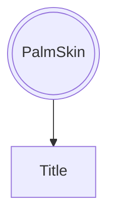

# mermaid test

[jump](#aaaa)

(some text)

(some text)

(some text)

(some text)

(some text)

(some text)

(some text)

(some text)

(some text)

(some text)

(some text)

(some text)

(some text)

(some text)

(some text)

(some text)

(some text)

(some text)

(some text)

(some text)

(some text)

(some text)

(some text)

(some text)

(some text)

(some text)

(some text)

(some text)

(some text)

(some text)

(some text)

(some text)

(some text)

(some text)

(some text)

(some text)

## aaaa
